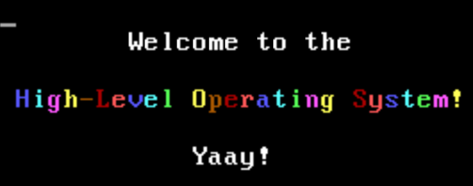
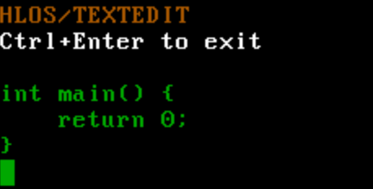
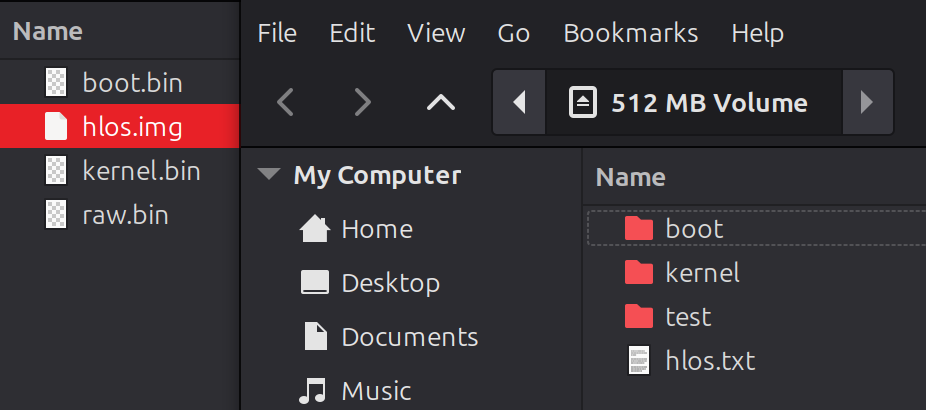
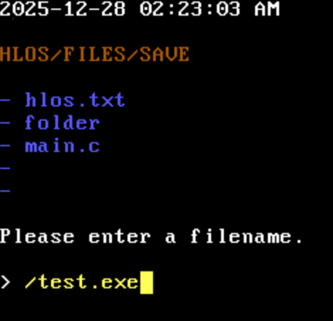

# High-Level Operating System

Welcome to the **High-Level Operating System** (HLOS). This was my big project that I was working on this past semester for my Operating Systems Principles and Applications class. I consider this to be the first big project for my Masters Degree in Computer Science at Southern New Hampshire University, and there will be more to come!

I have divided my work into 3 milestones, with the end goal to be getting a fully working FAT32 implementation. The milestones are as follows:

1. Milestone 1 - [Bootloader](#the-bootloader) + [Printing](#printing)
2. Milestone 2 - [IDT](#cpu-interrupts) + [Keyboard Input](#user-input)
3. Milestone 3 - [Heap](#heap-memory) + [File System](#fat32)
4. Bonus - [Rendering](#bonus---rendering)
5. [Conclusion](#conclusion)

## [The Bootloader](boot/boot.asm)

I quickly learned that writing an operating system completely in C wasn’t going to be possible, so I needed to learn some Assembly. This already opens a new can of worms since I now need to pick an assembly language and download an assembler ([NASM](https://www.nasm.us/)) for it. I decided to match my Intel x86-x64 processor and followed this tutorial by [nanobyte](https://youtube.com/playlist?list=PLFjM7v6KGMpiH2G-kT781ByCNC_0pKpPN&si=cgWbPhm8Uyf4glZL) to get a working bootloader that could print to the screen. I used [QEMU](https://www.qemu.org/) to emulate the operating system.

```asm
; Prints the string held in the source index register (16-bit)
print16:
	push si				; Push source index into the stack
	push ax				; Push accumulator into the stack
.loop:
	lodsb				; Load the next character into the accumulator
	or al, al			; Check for null-terminator character
	jz .exit			; Exit if null-terminator character
	mov ah, 0xE			; Set BIOS teletype function
	int 0x10			; Print character with a BIOS interrupt
	jmp .loop			; Loop
.exit:
	pop ax				; Pop accumulator from the stack
	pop si				; Pop source index from the stack
	ret					; Exit function
```

I soon discovered that I really don’t enjoy debugging assembly and needed a way to execute C code. However, the bootloader cannot simply run an executable file since they are compiled to the operating system you are running it on. Instead, your bootloader needs to enter 32-bit protected mode first and your C code must be compiled into raw binary so your bootloader can load it into memory and jump to it. I used [i686-elf-tools](https://github.com/lordmilko/i686-elf-tools) to compile my C kernel into binary with a custom [linker script](boot/linker.ld) to separate my bootloader from the C code. I then wrote a simple [shell script](boot-linux.sh) to compile and combine them into a single binary file. Now, when the bootloader loads the rest of the kernel into memory, it can jump right to it and begin executing C code.

## [Printing](kernel/print.h)

This is great except that you are starting with little to nothing when compiling C code to raw binary. There is no stdio.h since those functions use syscalls to talk to the kernel. The only standard headers I was able to use are listed in [extern.h](kernel/extern.h) and are just type declarations. Instead, I had to write my own ["standard library"](kernel/hlos.h), starting with a `print()` function. Printing is pretty trivial since in text mode (the default rendering mode), you simply write to a Video Graphics Array (VGA) buffer in memory located at address `0xB8000` to change the characters on the screen. I abstracted this into a VGA struct and was able to display a welcome message when the operating system successfully boots.

```c
/** Represents a single character in the Video Graphics Array. */
typedef struct VGA_char {
	/** The value of this character. */
	char_t character;

	/**
	 * The foreground and background color of this character.
	 * The low 4 bits represent the foreground color.
	 * The high 4 bits represent the background color.
	 */
	byte_t color;
} VGA_char_t;

/** Data for the state of the Video Graphics Array. */
typedef struct VGA {
	/** The address of the Video Graphics Array. */
	volatile VGA_char_t *const array;

	/** The current column of the Video Graphics Array. */
	byte_t column;

	/** The current row of the Video Graphics Array. */
	byte_t row;

	/** The current color of the Video Graphics Array. */
	byte_t color;
} VGA_t;

/** The Video Graphics Array. */
extern VGA_t VGA;
```



## [CPU Interrupts](kernel/interrupt.h)

Beginning milestone 2, I learned just how sophisticated the CPU actually is. In learning how to handle keyboard input asynchronously, I learned about the Interrupt Descriptor Table. These store bindings to what are essentially callbacks that your CPU regularly handles for important events such as input, timers, and errors such as (dividing by zero or invalid memory reads/writes). I inserted a stub into each interrupt to prevent crashing my kernel and created `IDT_bind()` to allow me to handle CPU interrupts.

```c
/** Represents a single entry in the Interrupt Descriptor Table. */
typedef struct IDT_entry {
	/** The low offset of the callback address. */
	ushort_t address_low;

	/** The code segment selector (from GDT). */
	ushort_t selector;

	/** The reserved byte (always zero). */
	byte_t reserved_byte;

	/** Flags for this interrupt. */
	byte_t flags;

	/** The high offset of the callback address. */
	ushort_t address_high;
} IDT_entry_t;

/** Sets and returns an entry in the Interrupt Descriptor Table. */
volatile IDT_entry_t *IDT_bind(
	PIC_entry_t index,
	void *callback,
	ushort_t selector,
	IDT_flags_t flags
);
```

While doing this, I learned that some instructions are required to be done in assembly. [assembly.h](kernel/assembly.h) contains these functions and are compiled separately so I may continue to develop the kernel in C while maintaining required functionality. Some functions like `in()` and `out()` are key to communicating with the computer's hardware.

```asm
; Reads a byte from the given IO port
in:
	push ebp				; Push base pointer to the stack
	mov ebp, esp			; Store the stack pointer
	mov dx, [ebp+8]			; Store <port>
	in al, dx				; Read from <port>
	pop ebp					; Pop base pointer from the stack
	ret						; Exit function

; Writes a byte to the given IO port
out:
	push ebp				; Push base pointer to the stack
	mov ebp, esp			; Store the stack pointer
	mov dx, [ebp+8]			; Store <port>
	mov al, [ebp+12]		; Store <num>
	out dx, al				; Write <num> to <port>
	pop ebp					; Pop base pointer from the stack
	ret						; Exit function
```

Since I was not able to get process scheduling done in one semester, I made a simple [coroutine system](kernel/event.h) for handling asynchronous code using the Programmable Interval Timer (PIT). I can bind a callback with an argument to be called after a set number of milliseconds and the timer interrupt will automatically call it. This is how I handle asynchronously updating the clock later.

```c
/** An asynchronous coroutine. */
typedef struct coroutine {
	/** The current handle for this coroutine. */
	handle_t handle;

	/** When this coroutine will be invoked. */
	uint_t schedule;

	/** The function to call. */
	void (*callback)(void *);

	/** A pointer to arguments for this coroutine. */
	void *args;
} coroutine_t;

/** Each bound coroutine. */
extern volatile coroutine_t coroutines[MAX_COROUTINES];
```

## [User Input](kernel/read.h)

Handling keyboard input was a big step from interrupts since we need to handle scancodes now. You can `in()` from certain ports to detect new keyboard input, but using the IDT I was able to automatically handle keyboard input the moment the user presses a key. Information related to input is stored in a ring buffer so we can store data related to keys and handle each key stroke individually in-order.

```c
/** The state of a single key press. */
typedef struct key_state {
	/** The scancode value of this key state. */
	byte_t code;

	/** Flags used to define this key state. */
	byte_t flags;

	/** The age of this key state. */
	ushort_t age;
} key_state_t;

/** The state of the user's keyboard. */
typedef struct keyboard {
	/** The index of the most recent key state in the queue. */
	ushort_t index;

	/** A circular queue of recent key states. */
	key_state_t queue[MAX_KEY_STATES];
} keyboard_t;

/** The current state of the user's keyboard. */
extern volatile keyboard_t keyboard;
```

For input that maps to a visible letter, I have two tables SCANCHAR and SCANSHIFT that map the scancodes to the actual letters. Most scancodes are one byte, but some scancodes use two bytes with the first as `0xE0` to indicate special input (like the arrow keys or duplicate keys on the right side of the keyboard). I manually mapped these to unused byte numbers starting at `0x81` so I can compact each scancode into a single byte.

The meat of keyboard input was implemented in the `read()` function, which functions similarly to the C# `Console.ReadLine()` function. This function allocates a buffer for user input and allows keyboard navigation including tabs and newlines. I also allow the function to enable or disable control characters to allow specific control over how input text is displayed on the screen since the size of the VGA buffer is limited. Like `print()`, `read()` has overloads for a single character and signed integer:

```c
/**
 * Reads an input string from the user, appended to <start>.
 * The maximum string length is min(<len>, MAX_INPUT_LEN).
 * The returned string is reused for all conversions.
 */
string_t read(uint_t len, bool_t ctrl_chars, string_t start);

/** Reads a single character from the user. */
char_t readchar();

/**
 * Reads an integer from the user.
 * If the user inputted a valid number, <num> is set to it.
 * Returns whether the read was successful.
 */
bool_t readint(int_t *num);
```

I used and tested this console input in a simple vi-style text editor:



## [Heap Memory](kernel/malloc.h)

At this point in the project, I was sorely missing `malloc()` and `free()`. For this final milestone, I was going to be dealing with a lot of memory. I was starting to run into some memory issues since my kernel was growing pretty big. I needed some new data structures in memory if I wanted to make room for the heap. I updated my [linker script](boot/linker.ld) to map out the RAM so it was clear where everything would be. I also utilized linker symbols so I would have the exact addresses of the starts and ends of all my data structures and code. It can definitley be optimized but for the purpose of learning, here is the final layout:

```
[Reserved]				0x0			:	0x7000
[16-bit Stack]			0x7000		:	0x7C00
[Bootloader]			0x7C00		:	0x7E00
[Kernel]				0x8000		:	KERNEL END
[32-bit Stack]			KERNEL END	:	0x80000
[IDT]					0x80000		:	0x89000
[VGA]					0xB8000		:	0xB9000
[Page Directory]		0x100000	:	0x101000
[Page Tables]			0x104000	:	0x2000000
[Kernel Heap]			0x2000000	:	0x20000000
[User Heap]				0x20000000 	:	RAM END
```

The bootloader, kernel, and VGA have very specific locations in memory, so I placed everything in order of where it is used and gave padding where neccessary. The two biggest regions (apart from the user heap) are the kernel and page tables. Before I can go allocating heap memory, three allocators needed to be created:

```c
/** A linked list of all allocated memory pages. */
typedef struct page {
	/** The address of the next memory page. */
	struct page *next;
} page_t;

/** A linked list of allocated memory blocks. */
typedef struct block {
	/** The size of this memory block. */
	uint_t size;

	/** The address of the next memory block. */
	struct block *next;
} block_t;

/** The next free Page Table. */
extern page_t *free_table;

/** The next free memory page. */
extern page_t *free_page;

/** The next free memory block. */
extern block_t *free_block;
```

RAM memory is divided up into 4 kilobyte pages. The CPU is able to map physical addresses (locations in RAM) to virtual addresses (addresses used in programs) using a data structure known as the page directory. The page directory is located in its own page and uses page tables to map virtual and physical addresses. I preallocated a large chunk of memory for new page tables and leave the rest of the RAM for the heap. Kernel memory is identity mapped (1:1 virtual mapping) to prevent immediate page fault crashes. To actually allocate in those pages, I use a block allocator for dividing up memory based on their size.

```c
/** Maps the given physical memory address to the given virtual memory address. */
void map(
	void *phys,
	void *virt,
	PDE_flags_t dir_flags,
	PTE_flags_t table_flags
);

/** Unmaps the given virtual memory address. */
void unmap(void *virt);

/** Allocates a new page of memory for either a Page Table or for the heap. */
page_t *pagealloc(bool_t table);

/** Deallocates a page of memory. */
void pagefree(page_t *page);
```

To recap: All memory is divided up into pages that act as a giant linked list in memory. `pagealloc()` pulls a new 4 kilobyte page to either be used as a page table for virtual mapping or as new heap memory. `map()` and `unmap()` automatically update or alloacte a new page table in the page directory so the CPU can safely map the memory. `malloc()` divides up premapped pages of memory into blocks for whatever the caller needs. The kernel is already identitiy mapped so `malloc()` can be used immediately. For future development, a process scheduler would allocate and map pages in the user heap for programs so they would get their own address space and can use `malloc()` as well. 

## [FAT32](kernel/file.h)

Unlike a lot of what I had developed up until this point, the 32-bit File Allocation Table (FAT32) is a standard implemented by most modern operating systems. This is simply a way to organize your hard drive so that files can be stored and retrieved later. My real goal with this final milestone was to allow my OS to read and write files from other operating systems. This final milestone had three submilestones:

1. Submilestone 1 - [Sectors](#sector-formatting)
2. Submilestone 2 - [FAT](#file-allocation-table)
3. Submilestone 3 - [File System](#file-system-api)

### Sector Formatting

The first submilestone was simply reading and writing to the hard drive. Similar to how the RAM organizes its memory into pages, the hard drive organizes itself into sectors. A sector is simply 512 bytes and is readable by a sector offset using a combination of `in()` and `out()` calls to the Advanced Technology Attachment (ATA). I implemented a `secread()` and `secwrite()` function to allow reading and writing to disk:

```c
/** Reads <num> number of 512-byte sectors at <sec> into <str>. */
char_t *secread(
	ATA_port_t port,
	byte_t drive,
	uint_t sec,
	byte_t num,
	char_t *str
);

/** Writes <str> into <num> number of 512-byte sectors at <sec>. */
string_t secwrite(
	ATA_port_t port,
	byte_t drive,
	uint_t sec,
	byte_t num,
	string_t str
);
```

Whats nice about an emulator like QEMU is that writing to the "hard drive" actually modifies the image file. Currently the image file is just the bootloader (one sector) and kernel code, which means any writes would corrupt important code. To fix this, I concatanated 512 megabytes to the kernel to simulate writing to an actual hard drive. I would then format the FAT32 instance at the 200th sector to give more than enough room for the kernel on disk. The next steps to implementing FAT32 was formatting the raw drive into FAT32.

```
[Bootloader]		Sector 0	:	Sector 1
[Kernel]			Sector 1	:	KERNEL END
[FAT32]				KERNEL END	:	Sector 1000000
```

I created two functions: `mount()` and `format()` which would either cache a FAT32 instance into memory or format a range of sectors into a usable FAT32 partition. FAT32 is a little complicated to explain here but to put it simply, there are 4 key data structures: the boot sector, the file system info, the file allocation table (FAT), and the root directory. The boot sector allows a FAT32 instance to be bootable like a bootloader. The file system info is used to speed up allocations and is used to check whether a FAT32 partition exists. The FAT indicates what clusters are available, and the root directory is the first location where files are stored.

```c
/** Mounts the given sector as a FAT32 partition. */
bool_t mount(
	ATA_port_t port,
	byte_t drive,
	uint_t start
);

/** Formats the hard drive for FAT32. */
bool_t format(
	ATA_port_t port,
	byte_t drive,
	uint_t start,
	uint_t clus_count,
	uint_t sec_count,
	bool_t force
);
```

`format()` simply writes these data structures to disk at the `<start>` sector. `<port>` and `<drive>` are used specify what hard drive to read/write from while `<clus_count>` specifies how many sectors one cluster is and `<sec_count>` specifies how many sectors a FAT32 instance will occupy. `mount()` checks a sector for a FAT32 instance and if one exists, loads its boot sector and FAT into memory for fast writes back to disk.

```c
/** Cached data for the File Allocation Table (32-bit). */
typedef struct FAT32_cache {
	/** Whether FAT32 is currently mounted. */
	bool_t mounted;

	/** The port used to read and write the FAT32 instance. */
	ATA_port_t port;

	/** The drive used to read and write the FAT32 instance. */
	byte_t drive;

	/** The boot sector of the FAT32 instance. */
	uint_t start;

	/** Cached data for the FAT32 boot sector. */
	FAT32_boot_t boot;

	/** Cached data for the FAT32 file system sector. */
	FAT32_FS_t FS;

	/** Cached data for the FAT32 sectors. */
	FAT32_cluster_t *table;
} FAT32_cache_t;

/** Cached data for the mounted File Allocation Table (32-bit). */
extern FAT32_cache_t FAT32;
```

Now that we have a FAT32 on disk, I updated my bootloader's master boot record so that the bootloader points to the FAT32 partition and can actually be mounted by other operating systems.



###File Allocation Table

FAT32 has this concept called clusters, which are contiguous sectors in memory used to divide up larger hard drives into bigger chunks of memory (this is crucial for extremely large drives). For simplicity, HLOS uses 1 sector wide clusters, but can be easily changed by updating the argument passed to `format()`. Files larger than one cluster are chained together in a linked list in the FAT.

The FAT itself is just an array of `int`s where each FAT entry is a cluster and the value is the index of the next cluster. There is a special end-of-file number used to signify the end of a cluster chain. The last thing to note about clusters is a special type of file known as a directory. A directory is essentially a 32-byte file that points to a cluster containing either a file or another directory. This is how you store metadata for files like their name, size, and permissions.

```c
/** File Allocation Table (32-bit) directory. */
typedef struct FAT32_directory {
	char_t name[8];
	char_t extension[3];
	byte_t attributes;
	byte_t reserved;
	byte_t create_ms;
	ushort_t create_time;
	ushort_t create_date;
	ushort_t open_date;
	ushort_t cluster_high;
	ushort_t write_time;
	ushort_t write_date;
	ushort_t cluster_low;
	uint_t size;
} __attribute__((packed)) FAT32_directory_t;
```

With all of this in mind, we now have everything we need to read and write to FAT32. From there I built 4 functions: `FAT32_alloc()`, `FAT32_load()`, `FAT32_find()`, and `FAT32_free()`. `FAT32_alloc()` allows writing data to the mounted FAT instance and automatically create directories as needed. `FAT32_load()` simply loads a cluster chain into memory. `FAT32_find()` takes a path like `/hlos/test.txt` and traverse the directories and cluster chains to locate the requested directory. `FAT32_free()` frees a directory clusters and subdirectories so it can be reallocated by FAT32 for new files.

```c
/** Allocates new clusters for the mounted FAT32 instance. */
FAT32_directory_t FAT32_alloc(
	string_t path,
	uint_t size,
	string_t data,
	FAT32_attributes_t attr,
	bool_t force,
	FAT32_cluster_t *clus
);

/**
 * Loads a cluster chain into memory.
 * This pointer must be freed!
 */
void *FAT32_load(FAT32_cluster_t clus, uint_t max);

/** Returns the directory for the file at the given path. */
FAT32_directory_t FAT32_find(string_t path, FAT32_cluster_t *clus);

/** Frees the cluster chain at the given path. */
bool_t FAT32_free(string_t path);
```

###File System API

This was definitley the hardest part of designing HLOS and I ended up making some nifty development tools like `step()` and `dump()` as I tested each function to ensure it was properly reading and writing to disk and correctly caching the FAT. The end result of being able to use HLOS as a working filesystem was super satisfying, and the last submilestone was to create nice wrappers around these functions for common file operations:

```c
/** Reads the file at <path> into <file>. */
bool_t fileread(string_t path, uint_t offset, uint_t size, char_t *file);

/** Writes <data> into the file at <path>. */
bool_t filewrite(string_t path, uint_t size, string_t data);

/** Appends <data> into the file at <path> */
bool_t fileappend(string_t path, uint_t size, string_t data);

/** Moves the file at <src> into <dest>. */
bool_t filemove(string_t dest, string_t src);

/** Deletes the file at <path>. */
bool_t filedelete(string_t path);

/** Outputs the size of the file at <path>. */
bool_t filesize(string_t path, uint_t *size);

/** Fills <list> with <size> number of files in <path>. */
uint_t filelist(string_t path, uint_t size, char_t *list);
```

The last thing I did this past semester was create a simple interface for reading, writing, and editing files. This interface is in [kernel.c](kernel/kernel.c) and exists to showcase my work in a clean CLI.




## [Bonus - Rendering](kernel/render.h)

On Christmas, I had some time on my hands and decided to research a little bit into rendering outside of the VGA. I discovered that the VGA is one of many rendering modes, and was able to whip up some simple rendering functions that can be enabled by uncommenting the following line in the bootloader and setting `PIXEL_RENDERING` to `1` in [render.h](kernel/render.h).

```asm
; Initializes the Video Graphics Array
init_VGA:
	mov ax, 0x3					; Store text mode command in data segment
	;mov ax, 0x13				; Store pixel mode command in data segment
	int 0x10					; Set VGA mode with a BIOS interrupt
	jmp protected_mode			; Enter 32-bit protected mode
```

Similar to the VGA, address `0xA0000` contains a 320 x 200 array of bytes that act as an index into a color palette. This color palette is automatically initialized in `init()` to be a quantized version of a 4-byte RGB color palette. I abstracted this array into what I call the Pixel Buffer Array (PBA):

```c
/** Data for the state of the Pixel Buffer Array. */
typedef struct PBA {
	/** The address of the Pixel Buffer Array. */
	volatile PBA_color_t *const array;

	/** The next frame buffer of the Pixel Buffer Array. */
	PBA_color_t next[PBA_SIZE];
} PBA_t;

/** The Pixel Buffer Array. */
extern PBA_t PBA;
```

You can write a pretty simple CPU rendering engine with this by using some functions I wrote to quickly write pixels to the buffer and updating the screen using `render()`. While I do not have any plans on expanding this, it's cool to see how a kernel might begin to implement a rendering pipeline for their graphics hardware. I tested it by making a simple noise engine with a square in the center which you can see below.

```c
/** Renders the frame buffer to the screen. */
void render();

/** Sets the color of a pixel. */
void pixel(point_t point, color_t color);

/** Fills an array of pixels with a color. */
void pixels(uint_t size, const point_t *points, color_t color);

/** Fills the screen with a color. */
void fill(color_t color);

/** Fills a square of pixels with a color. */
void square(point_t start, point_t end, color_t color);

/** Prints an 8 x 8 colored glyph to the screen. */
void glyph(point_t point, const byte_t *glyph, color_t color);
```


## Conclusion

Obviously, the end result is pretty small in comparison to a fully operational OS but I am proud of what I learned and was able to get done in just one semester. I think this project is a good testament to learning something you’re interested in:

When I initially proposed this project to my professor, she said it would be too hard to complete in just one semester. Instead she proposed we worked on MIT’s [xv6](https://github.com/mit-pdos/xv6-riscv) operating system, but after looking through its code and reading up on [OSDev Wiki](https://wiki.osdev.org), I felt strongly that I could create my own as well.

That was the motivation I needed to get started, and had I taken that warning and not just jumped right in, I wouldn’t have this project to show off today. So if you’re ever interested in learning something, the best advice I can give is to just dive right in and learn it, one step at a time.
